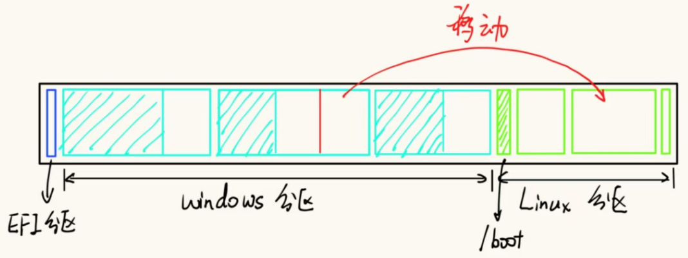
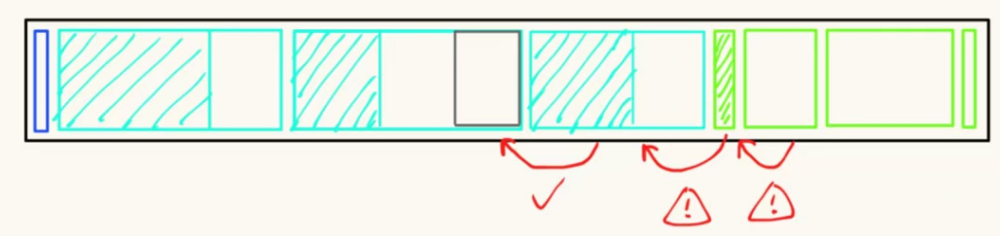
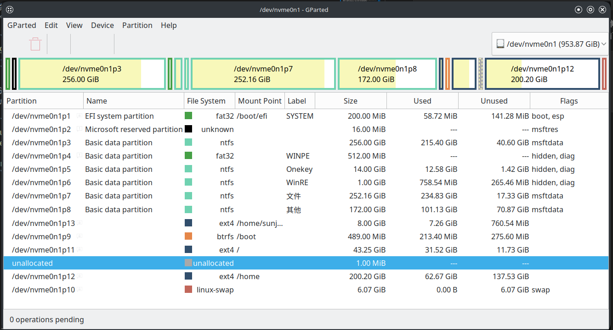

## 引言

之前在Windows笔记本上装了一个Linux系统，原本想的是这个Linux系统用于玩玩agent，因此没有给Linux留很多的空间。但后来发现Linux系统用起来也挺顺手，而且基本可以把电脑完全交给agent来管理，因此打算长期使用Linux系统。此时发现Linux中的空间不太够用，于是打算把Windows系统盘里面更多的空闲空间分配给Linux用。



有一种方便的方法，就是新建一个路径，然后把这个路径挂载到空闲空间上，但这样原本需要更大空间的位置就没法存入更多的数据。因此我想要把空闲空间移动到我想要扩容的目标挂载点上，然后进行扩容。整体磁盘的分区状态如上图所示，左边是Windows分区，右边是Linux分区。但这样会有如下的问题：



在已有的Linux系统中，利用GParted进行Windows分区的移动是很容易的，但无法直接进行当前Linux分区的移动，尤其是这里需要移动`/boot`分区。此外，在已有的Windows系统中，也无法使用DiskGenius对Linux的分区进行操作。网上查了一圈，好像没有人有写过类似的记录，询问了AI之后说这种情况需要借助LinuxLive USB来做。这篇博客就记录了我利用启动盘对磁盘分区进行移动的过程。

## 前置工作准备

- **数据备份**，把待处理的目标系统中重要的数据进行备份，毕竟这属于磁盘操作，一旦操作失败很有可能导致数据的丢失
- 一块LinuxLive USB
- 在现有系统中记录一下各个分区分别挂载的是什么地方

对于第二点，实际上这个只需要用最开始安装Linux用的启动盘来做就可以了，里面一般都会装有这样的环境。我们主要是要利用这个外部的临时系统来对电脑磁盘进行操作。

对于第三点，这个主要是为了后续操作的方便。刚才操作的时候我没有记录具体分区挂载的是什么位置，导致后面出了一些麻烦。具体的查看方法有多种，比如直接在现有Linux系统中打开GParted然后看`Partition`列和`Mount Point`列，记录下对应关系；或者用原生的方法，打开终端，输入`lsblk -f`，会列出像这样的内容：

```text
nvme0n1
├─nvme0n1p1  vfat     FAT32 SYSTEM DC9A-088D                             141.3M    28% /boot/efi
......
├─nvme0n1p9  btrfs                 a9803022-ed20-49d1-8783-d3074a15f7e5  195.3M    45% /boot
├─nvme0n1p10 swap     1            db10c61c-0bb4-4002-8810-78a14ff1b97b                [SWAP]
├─nvme0n1p11 ext4     1.0          6ff5661f-c122-425d-a026-ac1ad5e99949    9.5G    72% /
├─nvme0n1p12 ext4     1.0          6d6471ff-9417-41a8-8074-6b78be19e95e  127.5G    30% /home
└─nvme0n1p13 ext4     1.0          fb60d579-4a4d-45da-9e2c-e3403bdcb4ec  334.9M    90% /home/sunjiayang/texlive
```

最后一列就是挂载点，最前面的就是分区的号。把这个对应关系记录下来就好。像我这里的就是：

| 分区 | 挂载点 |
| --- | --- |
| nvme0n1p1  | `/boot/efi` |
| nvme0n1p9  | `/boot` |
| nvme0n1p10 | `[SWAP]` |
| nvme0n1p11 | `/` |
| nvme0n1p12 | `/home` |
| nvme0n1p13 | `/home/sunjiayang/texlive` |

> 注意这里特别要记录一下EFI所在的挂载点，一般是`vfat`文件系统的那个分区的挂载点。

## 进入启动盘

和安装系统时一样，插入启动盘，然后在开机的时候进入启动引导界面（我这里的华为笔记本是按F12），然后选择用USB启动，进入正常的Linux系统安装界面。

## 进行分区移动

此时不要进行安装流程，而是直接按`Ctrl+Alt+T`唤出终端，然后输入`gparted`唤出GParted应用。此时想要对里面所有的分区进行操作都是可行的，不像之前在已有Linux系统里面想要移动`/boot`分区却显示的是灰色，移动不了。此时按照GParted的UI引导进行分区移动和扩容即可，我这里做的就是把`/boot`分区移动到左边挨着Windows分区，再把`/`分区移动到左边挨着`/boot`分区，这样空间部分就挨着了我想要扩容的`/home`分区。然后再把`/home`分区扩容就可以了。

## 移动过后的处理

此时有一个关键的步骤，就是进行引导修复。因为移动了`/boot`分区，因此可能会导致原本的引导找不到系统启动的路径导致无法启动。在刚才移动的时候GParted也会提示这个问题，虽然在官网上说GRUB 2和GPT/EFI Windows installations相对来说更加稳定一些，但以防万一这一个操作还是有必要做的。

GParted官网在[FAQ](https://gparted.org/faq.php)里面给了各种系统的处理方案，我们这里可以参考[GRUB boot problem](https://gparted.org/display-doc.php?name=help-manual&lang=C#gparted-fix-grub-boot-problem)这个来做。

首先打开一个新的终端，然后在`/tmp`下面新建一个临时挂载点：

```bash
sudo mkdir -p /tmp/mydir
```

这个时候就要用到我们刚才记录下来的各个挂载点和分区对应的位置了。像我这里`/`是被`nvme0n1p11`分区挂载的，那么我们就把这个分区挂载到刚才我们创建的临时挂载点上：

```bash
sudo mount /dev/nvme0n1p11 /tmp/mydir # 挂载 /
```

然后将我们将`/boot`对应的分区（比如我这里是`nvme0n1p9`）挂载到`/tmp/mydir/boot`上面：

```bash
sudo mount /dev/nvme0n1p9 /tmp/mydir/boot # 挂载 /boot
```

> 注意：如果刚才的`/`没有挂载对，那么这里可能会显示找不到`/tmp/mydir/boot`这个路径。如果找不到，建议先检查一下分区有没有挂载对，如果挂载错了，那么可以把原本挂载的分区先卸载掉（就像我刚才做的一样），然后再挂载正确的分区

```bash
sudo umount /tmp/mydir # 卸载分区
```

然后按照官方的流程，输入下面这些指令：

```bash
sudo mount --bind /dev /tmp/mydir/dev
sudo mount --bind /proc /tmp/mydir/proc
sudo mount --bind /sys /tmp/mydir/sys
sudo mount --bind /run /tmp/mydir/run
```

这几个`--bind`的核心作用就是让接下来的`chroot`环境“借用”启动盘的系统接口，让`grub-install`和`update-grub`能够正常检测硬件、生成配置文件。

接下来切换root环境：

```bash
sudo chroot /tmp/mydir
```

然后重新安装GRUB2。这里官网上给的指令比较精简，可能会出现一些问题。按照grok给出的指令，这里需要指定`target`、`efi-directory`和`bootloader`：

```bash
grub-install --target=x86_64-efi --efi-directory=/boot/efi --bootloader-id=GRUB /dev/nvme0n1
```

这里的`--efi-directory`就是刚才我们在查看分区的时候看到的EFI的那个分区所在的挂载点。如果这一步没有问题，那么可以进行GRUB的更新，然后就可以重启电脑了：

```bash
update-grub
exit # 退出root环境

reboot # 重启电脑
```

## 总结

到这里就已经完整完成了分区的移动以及引导的修复。像我这里不出意外的话最终电脑可以正常重启，并进入Linux系统。再次查看磁盘状态，可以看到分区已经被正确移动，并且我这里的目标分区`/home`分区已经被扩容。



想要给双系统中的Linux系统扩容Windows的空闲空间还是比较麻烦的，但不是不可以。不过磁盘操作总归会有一定的数据丢失的风险，所以建议还是在最开始安装双系统的时候就规划好合理的磁盘分配。

---

### 参考资料

- [GParted FAQ](https://gparted.org/faq.php)
- [与Grok的聊天记录](https://grok.com/share/c2hhcmQtMi1jb3B5_afe5d457-03bc-4b8e-93bb-122e7746aae0)
